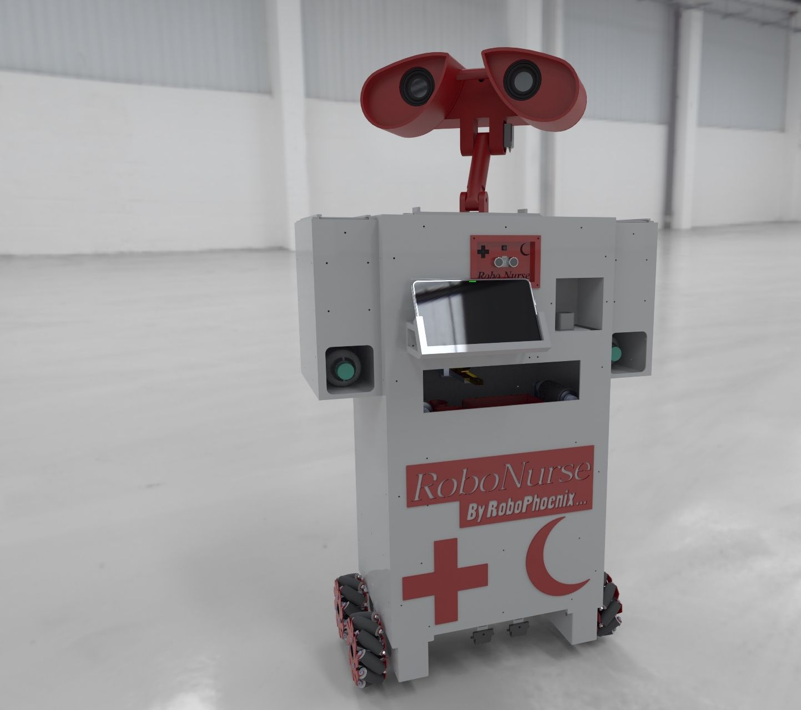

# RoboNurse – Autonomous Robotic Nursing Assistant

<div align="center">

**Intelligent Service Robot for Healthcare Environments**

*Navigation • Perception • Face Recognition • Voice Interaction • Dual HMI • Medicine & Food Delivery • Patient Monitoring*



[](https://docs.ros.org/en/humble/)
[](https://www.python.org/downloads/)

</div>

---

## 📋 Table of Contents

1. [Overview](#-overview)
2. [System Mission](#-system-mission)
3. [Key Features](#-key-features)
4. [Example Mission Flow](#-example-mission-flow)
5. [System Architecture](#-system-architecture)
6. [Repository Structure](#-repository-structure)
7. [Software Modules](#-software-modules)
8. [Hardware & Firmware](#-hardware--firmware)
9. [Quick Start](#-quick-start)
10. [Development Workflow](#-development-workflow)
11. [Security & Safety](#-security--safety)
12. [Contributing](#-contributing)

---

## 🎯 Overview

RoboNurse is a **ROS 2-based autonomous robotic nursing assistant** designed for safe patient assistance, HMI-driven service delivery, and advanced research in mobile perception and manipulation. Built to be modular, auditable, and safe for clinical-like settings, RoboNurse addresses the chronic shortage of nursing staff by automating repetitive, logistical tasks.

### Design Philosophy

- **Modularity**: Clear ROS 2 node boundaries with well-defined topic contracts
- **Safety-First**: Multiple layers of gating, watchdogs, and E-STOP handling
- **Portability**: ONNX models for inference on Jetson-class boards
- **Security**: Encrypted local face database for patient identity
- **Clinical-Grade**: Dual HMI system for operator oversight and patient interaction

---

## 🏥 System Mission

Hospitals face increasing workloads and staff shortages. RoboNurse autonomously performs:

- ✅ **Medicine delivery** (bottles, blister packs, syringes)
- ✅ **Meal delivery** (trays, drinks, snacks)
- ✅ **Patient interaction** (speech + tablet interface)
- ✅ **Identity verification** (face recognition)
- ✅ **Room verification** (QR-based validation)
- ✅ **Vital signs monitoring** (heartbeat sensor)
- ✅ **Safe navigation** with human-aware obstacle avoidance
- ✅ **Live video streaming** for staff oversight

**Goal**: Offload repetitive logistics to enable nursing staff to focus on direct clinical care.

### 📸 Robot in Action

<div align="center">

</div>

---

## 🌟 Key Features

### Perception & AI
- **YOLO-based Object Detection** (ONNX, CUDA-accelerated)
- **Face Recognition** with encrypted identity matching
- **Real-time Human Detection** for collision avoidance
- **Patient Status Monitoring** with temporal smoothing

### Navigation & Safety
- **Autonomous Path Planning** with SLAM/localization
- **Local Safety Planner** with IR sensor override
- **Human-Aware Movement** with dynamic replanning
- **Emergency Stop** (E-STOP) handling at hardware level

### Interaction Systems
- **Dual HMI Architecture**:
  - Operator interface for task assignment and monitoring
  - Patient interface for identity confirmation and service requests
- **Voice Interaction**: ASR (VOSK) and TTS (gTTS)
- **Video Streaming**: RTSP/WebRTC with recording capabilities

### Hardware Control
- **Mecanum Drive** with encoder-based odometry
- **Pan/Tilt Head** for camera positioning
- **Automated Dispensers** for medicine and food delivery
- **Sensor Suite**: IR, ultrasonic, bump sensors, heartbeat monitor

---

## 🔄 Example Mission Flow

A typical delivery mission demonstrates full system integration:

### 1️⃣ Task Assignment
Nurse selects task via **Operator HMI**:
> *"Deliver morning medication to Room 212 for patient Ahmed"*

### 2️⃣ Autonomous Navigation
- Localizes within hospital ward
- Plans safe path avoiding obstacles
- Adjusts trajectory around humans
- Monitors IR sensors for emergency stops

### 3️⃣ Room Identification
- Detects QR code near door
- Validates room number
- Cross-references with task data

### 4️⃣ Patient Verification
- Captures face image
- Matches against encrypted database
- Confirms identity with name/voice
- **Halts if mismatch detected**

### 5️⃣ Interaction & Confirmation
TTS greeting:
> *"Hello, I am RoboNurse. May I confirm your identity before delivering medication?"*

Patient responds via:
- Voice command (ASR)
- Touch input (Patient HMI)

### 6️⃣ Item Delivery
- Opens internal compartment
- Presents medicine/food
- Logs delivery time and confirmation

### 7️⃣ Vital Signs Check (Optional)
- Reads heartbeat sensor
- Transmits heart rate data
- Flags rhythm anomalies

### 8️⃣ Mission Completion
- Logs task completion
- Sends report to operator
- Returns to docking station

---

## 🏗️ System Architecture

```
┌─────────────────────────────────────────────────────────────┐
│                     OPERATOR HMI TABLET                     │
│           (Task Assignment • Video Feed • Logs)             │
└────────────────────────┬────────────────────────────────────┘
                         │ ROS2 Topics / WebRTC / REST
                         │
┌────────────────────────┴────────────────────────────────────┐
│                      ROBONURSE ROBOT                        │
│                                                             │
│  ┌──────────────┐  ┌──────────────┐  ┌─────────────────┐  │
│  │  Perception  │  │ Face Recog.  │  │  Voice (ASR/TTS)│  │
│  │ YOLO+Camera  │  │ ArcFace ONNX │  │  VOSK + gTTS    │  │
│  └──────┬───────┘  └──────┬───────┘  └────────┬────────┘  │
│         │                 │                    │            │
│  ┌──────┴─────────────────┴────────────────────┴────────┐  │
│  │              Navigation & Local Planning             │  │
│  │         SLAM • Path Planning • Obstacle Avoidance    │  │
│  └──────┬───────────────────────────────────────────────┘  │
│         │                                                   │
│  ┌──────┴────────┐  ┌──────────────┐  ┌─────────────────┐ │
│  │Hardware Control│  │Patient Status│  │ Video Streaming │ │
│  │Motors•Actuators│  │ QR • Vitals  │  │  RTSP/WebRTC   │ │
│  └────────────────┘  └──────────────┘  └─────────────────┘ │
│                                                             │
│  ┌─────────────────────────────────────────────────────┐   │
│  │                 PATIENT HMI TABLET                   │   │
│  │      (Identity Confirm • Service Request • Help)     │   │
│  └─────────────────────────────────────────────────────┘   │
└─────────────────────────────────────────────────────────────┘
```

---

## 📁 Repository Structure

```
Autonomous_Robotic_Nurse/
│
├── robonurse_nav/                    # Navigation & path planning
│   ├── local_planner_node.py        # IR-based safety controller
│   └── launch/                       # Nav2 integration
│
├── robonurse_perception/             # Vision & object detection
│   ├── perception_camera_node.py    # YOLO ONNX inference
│   └── models/                       # Detection models
│
├── robonurse_face_recognition/       # Patient identification
│   ├── face_recognition_node.py     # Real-time matching
│   ├── register_face.py             # Enrollment utility
│   └── db/                          # Encrypted embeddings
│
├── robonurse_voice/                  # Speech interaction
│   ├── speech_asr_node.py           # VOSK speech-to-text
│   └── speech_tts_node.py           # gTTS text-to-speech
│
├── robonurse_hmi/                    # Human-machine interfaces
│   ├── operator/                     # React-based operator UI
│   ├── patient/                      # React-based patient UI
│   └── teleop_bridge_node.py        # Command gating
│
├── robonurse_patient_status/         # Vitals & room tracking
│   └── patient_status_node.py       # Status aggregation
│
├── robonurse_hw/                     # Hardware abstraction
│   ├── motor_control_node.py        # Mecanum kinematics
│   ├── wheel_odometry_node.py       # Encoder-based odometry
│   ├── actuator_control_node.py     # Dispenser control
│   ├── head_interact_bridge.py      # Pan/tilt servo bridge
│   ├── firmware/
│   │   ├── mega_motor_control.ino   # Arduino Mega (motors)
│   │   └── nano_head_control.ino    # Arduino Nano (head/audio)
│   └── scripts/                      # Hardware utilities
│
├── video_stream_node/                # Camera streaming
│   ├── video_stream_node.py         # RTSP/WebRTC server
│   └── config/                       # Stream parameters
│
├── robonurse_interfaces/             # Custom ROS messages/services
│   ├── msg/                          # Custom message types
│   └── srv/                          # Service definitions
│
└── images/                           # Documentation assets
    ├── 1646784162494.jpg            # Robot render
    ├── robot_motion.gif             # Movement demo
    ├── hmi_operator.png             # Operator UI screenshot
    └── hmi_patient.png              # Patient UI screenshot
```

---

## 🔧 Software Modules

### 🎥 Perception System

#### `perception_camera_node`
**Package**: `robonurse_perception`

**Purpose**: Real-time visual understanding using YOLO-based detection

**Key Behavior**:
- Publishes `/camera/image_raw` (sensor_msgs/Image)
- Publishes `/people/detections` (vision_msgs/Detection2DArray)
- CUDA-accelerated inference on Jetson
- Configurable confidence and NMS thresholds

**Parameters**:
```yaml
model_path: "models/yolov5.onnx"
classes_path: "models/classes.txt"
input_size: 640
conf_threshold: 0.5
nms_threshold: 0.4
use_cuda: true
```

---

#### `face_recognition_node`
**Package**: `robonurse_face_recognition`

**Purpose**: Patient identity verification with encrypted database

**Key Behavior**:
- Subscribes to `/camera/image_raw` and `/people/detections`
- Computes L2-normalized face embeddings (ArcFace ONNX)
- Matches against encrypted Fernet database
- Publishes `/people/identity` with JSON payload:
  ```json
  {"id": "patient_01", "distance": 0.32}
  ```

**Security**: Symmetric encryption with Fernet keys. Restrict key permissions.

**Enrollment**:
```bash
python register_face.py \
  --image images/patient01.jpg \
  --id patient_01 \
  --model models/arcface.onnx \
  --db /var/robonurse/db/faces.enc \
  --key /var/robonurse/db/fernet.key
```

---

### 🎤 Voice Interaction

#### `speech_asr_node`
**Package**: `robonurse_voice`

**Purpose**: Offline speech recognition using VOSK

**Key Behavior**:
- Captures microphone audio
- Publishes `/speech/text` (std_msgs/String)
- Keyword spotting for commands
- No internet dependency

**Requirements**: VOSK model on disk (specify language)

---

#### `speech_tts_node`
**Package**: `robonurse_voice`

**Purpose**: Text-to-speech synthesis

**Key Behavior**:
- Subscribes to `/speech/say` (std_msgs/String)
- Uses gTTS for natural voice generation
- Plays audio via mpg123 for low latency

---

### 🗺️ Navigation System

#### `local_planner_node`
**Package**: `robonurse_nav`

**Purpose**: Fast local safety controller with sensor override

**Key Behavior**:
- Subscribes to `/sensor/ir` (Range) and `/nav_cmd_vel` (Twist)
- Publishes safe `/cmd_vel` to actuators
- **Emergency stop** if IR detects obstacles < `ir_stop_distance`
- Hysteresis prevents oscillation

**Integration**: Works parallel to Nav2 for safety-critical short-range stops

**Parameters**:
```yaml
ir_stop_distance: 0.3  # meters
ir_resume_distance: 0.5  # meters
```

---

### 🎮 Human-Machine Interfaces

#### `teleop_bridge_node`
**Package**: `robonurse_hmi`

**Purpose**: Gate and relay operator commands with mode enforcement

**Key Behavior**:
- Subscribes to `/joy_vel`, `/robot/mode_switch`, `/manipulator/control`
- Maintains `current_mode` ('manual'/'autonomous')
- **Only relays manual commands in manual mode**
- Publishes to `/cmd_vel`, `/system/manipulator_action`, `/system/emergency_trigger`

**Safety**: Prevents manual override during autonomous missions

---

#### Operator HMI
**Location**: `robonurse_hmi/operator/`

**Features**:
- Task assignment interface
- Live video feed (WebRTC)
- Robot status dashboard
- Mission logs and history
- Manual override controls


<div align="center">

</div>
---

#### Patient HMI
**Location**: `robonurse_hmi/patient/`

**Features**:
- Identity confirmation
- Service requests (food, water, nurse call)
- Emergency alert button
- Medication acceptance
- Health instructions display

<div align="center">

</div>
---

### 🤖 Hardware Control

#### `motor_control_node`
**Package**: `robonurse_hw`

**Purpose**: Translate `/cmd_vel` to wheel velocities for Arduino Mega

**Key Behavior**:
- Converts Twist to 4-wheel speeds (mecanum kinematics)
- Sends binary serial packets: header `0xAA 0x55` + cmd + CRC8
- **Watchdog**: sends stop if no `/cmd_vel` within timeout

**Parameters**:
```yaml
serial_port: "/dev/ttyACM0"
baudrate: 115200
wheel_radius: 0.0762  # meters
base_width: 0.42  # meters
base_length: 0.38  # meters
max_speed: 1.0  # m/s
watchdog_timeout: 0.5  # seconds
```

---

#### `wheel_odometry_node`
**Package**: `robonurse_hw`

**Purpose**: Parse encoder telemetry and publish odometry

**Key Behavior**:
- Parses packets from Mega (header `0x55 0xAA`, pkt_id `0x10`)
- Computes delta encoder distances
- Estimates velocities (vx, vy, ωz) via mecanum kinematics
- Publishes `/odom` (nav_msgs/Odometry)

**Note**: Position integration left as zero; provides velocity-only odometry for fusion

---

#### `actuator_control_node`
**Package**: `robonurse_hw`

**Purpose**: Service interface for medicine/food dispensing

**Service**: `/dispense/item` (robonurse_interfaces.srv.DispenseItem)

**Key Behavior**:
- Sends serial commands to Arduino Mega
- Waits for ACK packet
- Logs dispense events with timestamps

---

#### `head_interact_bridge`
**Package**: `robonurse_hw`

**Purpose**: Control pan/tilt servos and audio via Arduino Nano

**Topics**:
- Publishes: `head/pan_command`, `head/tilt_command` (Int16)
- Subscribes: `head/pan_status` (feedback from Nano)

**Integration**: Uses rosserial for Arduino communication

---

### 📊 Patient Status

#### `patient_status_node`
**Package**: `robonurse_patient_status`

**Purpose**: Aggregate detections into high-level patient status

**Key Behavior**:
- Subscribes to `/people/detections`, `/sensor/heartbeat`, `/camera/qr`
- Applies temporal smoothing and priority selection
- Publishes `/patient/status` (e.g., "sitting", "lying", "needs_assistance")

---

### 📹 Video Streaming

#### `video_stream_node`
**Package**: `video_stream_node`

**Purpose**: Low-latency video to operators

**Key Behavior**:
- Subscribes to `/camera/image_raw`
- Streams to RTSP URL via FFmpeg (H.264 encoding)
- Hardware acceleration on Jetson
- Services: `/video/start_recording`, `/video/stop_recording`

**Config**:
```yaml
stream_url: "rtsp://localhost:8554/robonurse"
codec: "h264_nvenc"  # Hardware encoding
bitrate: "2M"
framerate: 30
```

---

## 🔩 Hardware & Firmware

### Arduino Mega (`mega_motor_control.ino`)
**Responsibilities**:
- 4x motor driver control (PWM + direction)
- Encoder interrupts (quadrature)
- IR and ultrasonic sensor reading
- E-STOP monitoring
- Actuator sequences (dispensers)
- Serial telemetry (odometry packet `0x10`)

**Protocol**: Host→Mega packets start with `0xAA 0x55`, Mega→Host with `0x55 0xAA`. CRC8 checksum validation.

**Pin Configuration**: Verify mappings match your hardware before deployment.

---

### Arduino Nano (`nano_head_control.ino`)
**Responsibilities**:
- Pan/tilt servo control (PWM)
- DFPlayer MP3 module control
- Rosserial subscriber loop
- Status feedback publishing

**Communication**: USB serial with rosserial bridge


---

## 🔐 Security & Safety

### Patient Privacy
- ✅ Face database uses **Fernet symmetric encryption**
- ✅ Restrict key file permissions: `chmod 600 /var/robonurse/db/fernet.key`
- ✅ Consider HSM or keyring integration for production
- ✅ Log all access and modifications
- ✅ Implement data retention policies per HIPAA/GDPR

### Physical Safety
- ✅ **E-STOP must be tested** before each deployment
- ✅ Watchdog enforces stop commands on timeout
- ✅ Local planner overrides navigation for emergency stops
- ✅ Bump sensors provide hardware-level collision detection
- ✅ Test in controlled environment before clinical trials

### Network Security
- ✅ Use encrypted WebRTC/HTTPS for video streaming
- ✅ Implement authentication for operator HMI
- ✅ Firewall rules for ROS 2 DDS communication
- ✅ Regular security audits of dependencies

### Logging & Compliance
- ✅ Record all patient interactions with timestamps
- ✅ Maintain audit trail for dispensing events
- ✅ Anonymize logs for research/debugging
- ✅ Consent management for biometric data

---

## 📈 Future Enhancements

- [ ] Multi-robot coordination and fleet management
- [ ] Advanced manipulation with robotic arm integration
- [ ] Cloud integration for remote monitoring
- [ ] Machine learning for patient behavior prediction
- [ ] Integration with hospital EMR systems
- [ ] Natural language understanding for complex queries
- [ ] Autonomous elevator navigation
- [ ] Multi-floor SLAM mapping

---

## 👤 Author & Contact

**Ibrahim Al Dabbagh**  
📧 eng.ibrahim.aldabbagh@gmail.com


---

<div align="center">

**RoboNurse** – Advancing Healthcare Through Intelligent Robotics

*Built with ❤️ for safer, more efficient patient care*

</div>